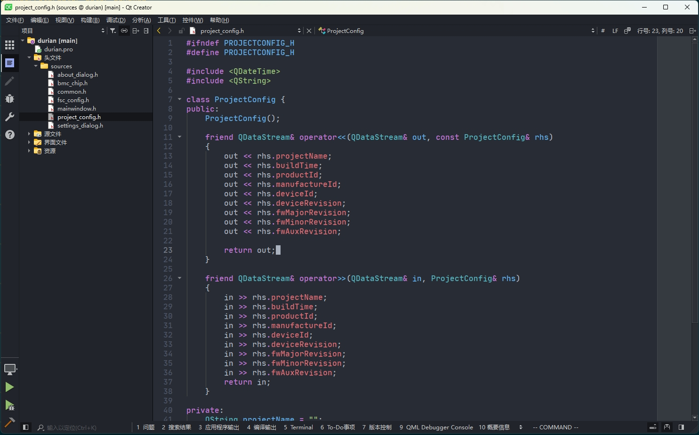
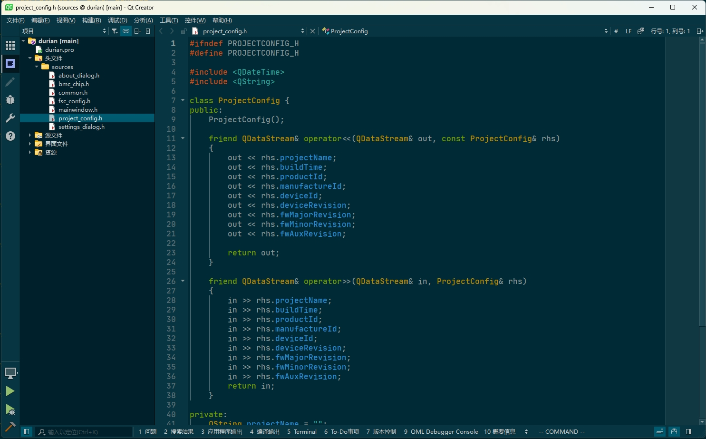

# Install
* put styles/*.xml and themes/*.creatortheme to your qtcreator install folder

## One Dark (Atom)
Works best with One Dark Theme and an environment color like #313848

## Solarized Dark
Comes included in QtCreator, but without a matching QtCreator theme (themes/solarized-dark.creatortheme).
Recommended environment color for this theme: #0096c8 (or similar)

